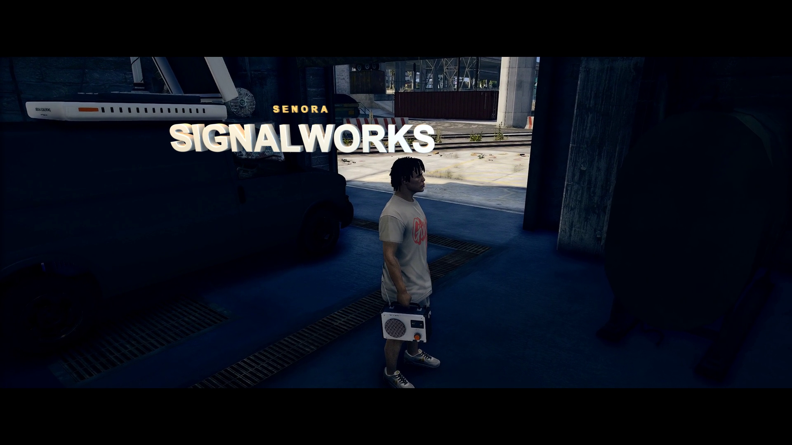

# Senora Signalworks

<p align="center">
  
</p>

<p align="center"><strong>0.3.11 · Free source · Qbox / QBCore / ESX adapters</strong></p>
<p align="center">
  <a href="https://docs.chasedev.dev/signalworks/installation">Documentation</a> ·
  <a href="https://github.com/chase5m/senora-signalworks/releases/latest">Download</a> ·
  <a href="https://discord.gg/n8W5JRJ96s">Discord</a> ·
  <a href="https://github.com/chase5m/senora-signalworks/tree/main">Source</a>
</p>

**A mobile radio station for FiveM, created by Chase.** Collect a studio van, deploy its equipment, choose a frequency and bring a station to your server. Players listen through a carried Field Radio, a physical Dash Receiver or private Signalbuds.

This is the **0.3.11 free source release**, based on the accepted 0.3.10 runtime. The Lua, React/TypeScript UI, configuration and integration adapters are readable and editable. A built UI and the required equipment assets are included; players and server operators do not need Node.js or Blender to install it.

[Installation](docs/INSTALL.md) · [Configuration](docs/CONFIGURATION.md) · [Controls](docs/COMMANDS.md) · [License](LICENSE.md)

## What is included

- Mobile studio van with deployable equipment, station frequencies, crew access, battery management, requests and tips.
- Live station microphones, co-hosts and listener calls through the included pma-voice bridge.
- Bundled original ident/intermission audio and YouTube/SoundCloud queues with DJ and autonomous modes.
- Field Radio hand/shoulder modes, floor placement and pickup, distance-based speaker audio.
- Player-positioned dashboard receivers with saved mounts for registered vehicles and an interactive physical display.
- Signalbuds, optional LB Phone integration, a frequency directory and a police scanner.
- Qbox, QBCore and ESX adapters, with ox_inventory, qb-inventory or standard ESX inventory support.

Compatibility adapters are supplied; this is not a claim that every framework, voice customization or third-party vehicle has been tested live. See [verification scope](docs/TESTING.md).

## Install

1. Name this resource folder **`chase_bootleg`** and place it in your server's resources directory. Keep that name: item exports, NUI URLs and integration contracts use it.
2. Install the required dependencies, import all four SQL files in order, and merge the matching job/item definitions. Follow [INSTALL.md](docs/INSTALL.md) for exact steps.
3. Edit **`config.lua`** for common settings. Advanced configuration lives under `config/`; no gameplay file edits are needed for ordinary setup.
4. Install and inspect the protocol-3 pma-voice bridge before enabling live station microphones, then start dependencies before this resource.

The defaults select the running framework and vehicle-key provider automatically. Debug mode is off. This differs from the development runtime's explicit Qbox/key selection and debug mode; other configuration values are preserved.

## Work on the UI

| Source | Responsibility |
| --- | --- |
| `client/` and `server/` | Gameplay, station state, receivers and validation |
| `integrations/` | Editable inventory, keys, phone and PMA adapters |
| `ui/src/` | React/TypeScript interface and audio behavior |
| `config.lua` and `config/` | Everyday settings and advanced tuning |
| `installation/`, `sql/`, `stream/` | Setup definitions, schema and ready-to-use assets |

The `ui/` directory contains the React/TypeScript source and locked dependencies. With a Node.js version supported by the included Vite package installed:

```sh
cd ui
npm ci
npm run check
npm run build
```

The build writes `web/`. Runtime JavaScript is formatted without identifier obfuscation, and all third-party notices remain in separate notice files. `npm run dev` opens a local development server; append `?preview=1` to use the supplied mock preview. Mock data is not live server evidence.

The README image is a real game capture with the trailer's 3D title composited into it; the title is a presentation treatment, not a gameplay feature.

## Free use terms

Free use and modification are allowed on your own servers and customer servers, including normal server monetization. Free redistribution is allowed under the same terms with source and attribution preserved. **Resale, paid distribution and rebranding as your own script are not allowed.** Read the complete [Chase Free Source License](LICENSE.md).

This is a source-available release under custom terms, not an OSI-approved open-source license. Third-party components keep their original licenses; see [NOTICE.md](NOTICE.md).

## Testing and support

The underlying 0.3.10 build was tested in one local Qbox player session: van collection, distance refusal, deployment, broadcast start/stop, local ident playback, Field Radio tuning/equipment, floor placement/pickup and normal cleanup were observed. The hand grip and ordinary walking were previously accepted by the user. Those observations do not establish multiplayer voice, remote prop synchronization, all peds, dashboard compatibility or recovery from every interruption.

This release changes packaging, configuration organization and source formatting. It has not replaced or restarted the live server. Current automated checks and remaining native checks are documented in [TESTING.md](docs/TESTING.md).

For help, include your framework, inventory/voice versions, resource version and the relevant error text in [Discord](https://discord.gg/n8W5JRJ96s). Keep credentials and player identifiers out of public reports.
